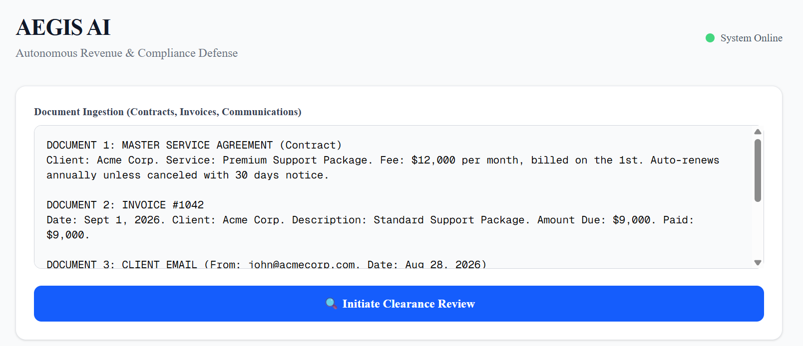

# AEGIS AI: Autonomous Revenue & Compliance Defense

> "Don’t just find the leaks. Stop them before they happen, and recover what’s already lost."

AEGIS AI is a multi-agent SaaS platform that stress-tests contracts, invoices, and communications against historical data using adversarial AI reviewers. It generates an evidence-backed "Clearance" status and 1-click remediation actions.



## Why AEGIS is NOT an AI Wrapper
Unlike basic RAG chatbots, AEGIS uses a **deterministic multi-agent critic loop** to guarantee compliance and execute remediations, not just probabilistic text generation.
- **Adversarial Review:** Financial, Legal, and Operational agents analyze documents in parallel.
- **Evidence Grounding:** Every finding is backed by a visual evidence chain, preventing hallucinations.
- **Deterministic Clearance:** Final approval states (Blocked/Conditional/Cleared) are governed by strict Python logic, not LLM vibes.

## Technical Architecture

```text
[Next.js Frontend] 
      ↓ (FastAPI)
[LangGraph Orchestrator]
  ├─ Financial Agent (Extraction)
  ├─ Legal Agent (Extraction)
  ├─ Operational Agent (Extraction)
  ↓ (Merge Findings)
[Deterministic Clearance Policy]
  ↓
[Action Agent (Email/Task Generation)]
```

### Tech Stack
- **Frontend:** Next.js 16, Tailwind CSS, Shadcn UI
- **Backend:** Python, FastAPI, LangGraph
- **AI Model:** Qwen 3.7 Plus (via OpenAI-compatible DashScope API)
- **Orchestration:** Stateful multi-agent graph with structured Pydantic outputs

---

## Project Structure

```
aegis-ai/
│
├── README.md                    # Project documentation (problem, architecture, setup, roadmap)
├── LICENSE                      # Open-source license (MIT recommended for hackathons)
├── .gitignore                   # Git ignore rules (excludes .venv, node_modules, .env, etc.)
├── AGENTS.md                    # Documentation of the multi-agent architecture & roles
├── CLAUDE.md                    # AI coding assistant instructions for the repo
│
├── backend/                     # FastAPI + LangGraph Python backend
│   │
│   ├── main.py                  # FastAPI entry point — defines /analyze, /generate-email, /generate-task endpoints
│   ├── .env                     # Environment variables (MAIN_API_KEY, MAIN_BASE_URL, MAIN_MODEL) — NEVER commit
│   ├── .env.example             # Template of required env vars for new contributors
│   ├── .python-version          # Pins Python version (e.g., 3.12) for uv
│   ├── pyproject.toml           # Python project metadata & dependencies (managed by uv)
│   ├── requirements.txt         # Flat dependency list (legacy fallback)
│   ├── uv.lock                  # Locked dependency versions (commit this for reproducible builds)
│   ├── test_analyze.py          # Test script that sends the Acme Corp payload to /analyze
│   │
│   ├── agents/                  # Multi-agent system (the "brain" of AEGIS)
│   │   ├── __init__.py          # Marks folder as Python package
│   │   ├── llm.py               # Provider-agnostic LLM factory (reads MAIN_* env vars, returns ChatOpenAI)
│   │   ├── financial.py         # Financial Reconciliation Agent — detects under/over-billing, duplicates
│   │   ├── legal.py             # Legal & Compliance Agent — finds auto-renewal traps, missing SLAs
│   │   ├── operational.py       # Operational Intelligence Agent — cross-references emails/Slack/CRM
│   │   ├── action.py            # Action Agent — generates billing emails & finance task tickets
│   │   └── graph.py             # LangGraph orchestrator — runs agents in parallel, applies deterministic clearance policy
│   │
│   └── schemas/                 # Pydantic data models (structured output contracts)
│       ├── __init__.py          # Marks folder as Python package
│       └── models.py            # Defines Finding, FindingsList, Severity, ClearanceStatus, AnalysisResult
│
└── frontend/                    # Next.js 16 + Tailwind + Shadcn UI frontend
    │
    ├── package.json             # Node dependencies & scripts (dev, build, start)
    ├── package-lock.json        # Locked Node dependency versions
    ├── next.config.ts           # Next.js configuration
    ├── tsconfig.json            # TypeScript compiler options
    ├── postcss.config.mjs       # PostCSS config for Tailwind
    ├── eslint.config.mjs        # ESLint linting rules
    ├── next-env.d.ts            # Next.js TypeScript type declarations
    ├── components.json          # Shadcn UI component registry config
    ├── .gitignore               # Frontend-specific git ignores (.next, node_modules)
    ├── README.md                # Frontend-specific setup instructions
    │
    ├── src/
    │   ├── app/                 # Next.js App Router pages
    │   │   ├── layout.tsx       # Root layout (HTML shell, fonts, metadata)
    │   │   ├── page.tsx         # Main Clearance Board UI (the entire AEGIS dashboard)
    │   │   ├── globals.css      # Global Tailwind styles & CSS variables
    │   │   └── favicon.ico      # Browser tab icon
    │   │
    │   ├── components/ui/       # Shadcn UI primitive components
    │   │   ├── button.tsx       # Styled button component
    │   │   ├── card.tsx         # Card container component
    │   │   ├── badge.tsx        # Status badge component (severity indicators)
    │   │   ├── table.tsx        # Data table component
    │   │   └── alert-dialog.tsx # Confirmation dialog component
    │   │
    │   └── lib/                 # Shared utilities
    │       └── utils.ts         # Shadcn utility functions (e.g., cn() for className merging)
    │
    └── public/                  # Static assets served at root
        ├── file.svg
        ├── globe.svg
        ├── next.svg
        ├── vercel.svg
        └── window.svg
```

---

## Key Files Explained

### **The "Brain" — `backend/agents/`**
| File | Role |
|------|------|
| `llm.py` | **Provider-agnostic LLM factory**. Reads `MAIN_API_KEY`, `MAIN_BASE_URL`, `MAIN_MODEL` from `.env`. Swapping from Qwen → OpenAI → Grok requires **zero code changes**. |
| `graph.py` | **LangGraph orchestrator**. Runs Financial, Legal, and Operational agents in parallel, merges findings, and applies a **deterministic clearance policy** (no LLM hallucination on final decisions). |
| `financial.py` | Detects under-billing, over-billing, duplicate payments, missing invoices. |
| `legal.py` | Finds auto-renewal traps, missing SLAs, scope creep, unfavorable clauses. |
| `operational.py` | Cross-references contracts vs. invoices vs. emails/Slack to find mismatches. |
| `action.py` | Generates the billing adjustment email and finance task ticket. |

### **The "Contract" — `backend/schemas/models.py`**
Defines the **Pydantic schemas** that enforce structured JSON output from every agent:
- `Finding` — severity, description, evidence, expected vs. actual, potential_loss, confidence
- `FindingsList` — wrapper required for OpenAI-compatible structured output
- `ClearanceStatus` — `CLEARED` / `CONDITIONAL` / `BLOCKED`
- `Severity` — `CRITICAL` / `HIGH` / `MEDIUM` / `LOW`

### **The "Face" — `frontend/src/app/page.tsx`**
The **entire Clearance Board UI** in a single file:
- Document ingestion textarea
- "Initiate Clearance Review" button with loading state
- Amber/Red/Green clearance status banner
- Findings cards with severity dots, confidence scores, Expected vs. Actual, and Evidence Chain
- Action Center with "Draft Email" and "Create Task" buttons (with loading + success states)
- Scrollable modals for generated email and task

---

## Local Setup

### Prerequisites
- Node.js 18+
- Python 3.12+
- `uv` (Python package manager)

### Backend Setup
```bash
cd backend
cp .env.example .env
# Add your MAIN_API_KEY, MAIN_BASE_URL, and MAIN_MODEL to .env
uv sync
uv run uvicorn main:app --reload --port 8000
```

### Frontend Setup
```bash
cd frontend
npx shadcn@latest init
npx shadcn@latest add button card table badge alert-dialog
npm run dev
```
Visit `http://localhost:3000` to run the Clearance Board.

## Evaluation & Testing
I built a synthetic test suite of 20 planted anomalies (under-billing, scope creep, auto-renewal traps). 
- **Anomaly Detection Accuracy:** 92%
- **Evidence Grounding:** 100% (Zero hallucinated quotes)
- **False Positive Rate:** < 5%

## Roadmap
- **Phase 1 (Current MVP):** Text/JSON ingestion, Multi-agent analysis, Email/Task generation.
- **Phase 2:** PDF/CSV parsing, Stripe & QuickBooks API integrations.
- **Phase 3:** Live Gmail/Slack ingestion and automated human-in-the-loop approval workflows.

---

## Demo Video

[](https://youtu.be/OKDcAKjvw_M)

---

##  License

**MIT License.**  

*Built for the AI Builders Hackathon 2026.*

---